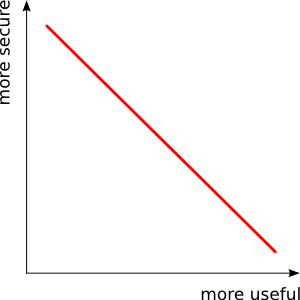

Anonymization of health care data
=================================

Health information is widely acknowledged to be sensitive personal information. Information of this type may contain facts about an individual that can be used by insurance companies, future employers or others against the benefit of the person involved. For this reason, in many countries and jurisdictions, gathering, storing and publishing such data by third parties is limited by laws and [regulations](http://en.wikipedia.org/wiki/Data_Protection_Directive). In general, the gist of this type of legislation is twofold. For a third party to be allowed to process health data, either:

* the person the information is about has given permission for usage
* the data is changed in such a way that it is not possible to determine the identity of the individual

Although health data is sensitive in the sense described above, large health datasets can offer a wealth of information to scientists and researchers, for example in determining the effects of specific medication or finding correlations between lifestyle and disease. However, datasets with this type of information may not be used without satisfying either of the conditions mentioned.

The [AXLE project](http://axleproject.eu) investigates the implications and feasibility of doing [analytics](http://en.wikipedia.org/wiki/Analytics) on extremely large datasets (*large* meaning 10-100 TB). From the description of work document:

> AXLE takes the need for *privacy of medical data* as a metaphor for the requirements for privacy of any personal data: how to make analytics available in a timely manner without compromising confidentiality.

Especially for large existing datasets such as the one AXLE intends to operate on, it can be very difficult, if not completely infeasible, to obtain permission from each individual in the dataset. In order to use this data without jeopardizing an individuals privacy and stay within legal boundaries, the data needs to be changed in such a way that it is impossible to determine the identity of individual the information is about. This process is commonly referred to as *anonymization*.

## Techniques for anonymization

A common solution for anonymization is simply removing all values from the dataset that identify a person directly, e.g. remove a person's name and SSI. Sometimes a variant known as *pseudonimization* is used, where this information is not removed, but replaced by a specific ID number. This ID number can only be traced back to the person involved through a Trusted Third Party (TTP).

Depending on context, these methods have advantages and disadvantages. One important observation however, is that very often the first precondition is not adequately satisfied: _it is still possible to infer the identity of the person involved from the given data_.

Consider the following (hypothetical) example of an anonymized dataset published by Dr Bob for medical research.

##### Patients of Dr. Bob

| Name   | Gender   | Age   | Occupation      | Medical condition   |
| ------ | -------- | ----- | ------------    | ------------------- |
| ****   | Male     | 41    | Engineer        | COPD                |
| ****   | Female   | 65    | Baker           | Diabetes            |
| ****   | Male     | 21    | Chef            | Diabetes            |
| ****   | Female   | 38    | Programmer      | Diabetes            |
| ****   | Female   | 12    | None            | COPD                |
| ****   | Male     | 32    | Secretary       | Diabetes            |
| ****   | Female   | 18    | Chef            | COPD                |
| ****   | Male     | 55    | Pilot           | COPD                |
| ****   | Male     | 51    | Manager         | Diabetes            |
| ****   | Female   | 17    | None            | Diabetes            |

At first glance, no identifiable information has been leaked in this dataset: no names are published and the amount of information is limited. However, suppose you see the following person walk out of Dr. Bob's practice:

You can recognise several characteristics about this person:

* She is a woman
* She is quite young (at least younger than 20 by estimation)
* She has an occupation as chef or baker (or something that requires similar attire)

While any of these characteristics by themselves would match multiple records in the dataset, there's only one record that satisfies all three. Therefore we can learn the medical condition of this person and Dr. Bob has revealed personal information about one of his patients.

Of course, in this example re-identifying a person is quite easy, because the dataset is relatively small. In a larger dataset, one could argue, more young, female chefs might be included, making it more difficult or even impossible to determine the extact record in the dataset depicting the person from the photo.

This argument makes sense; a real-world dataset would probably contain many more records than the example. However, such a real-world dataset usually also contains many more columns (i.e. more data per record). It's not diffcult to see that more data increases the risk of re-identification again. Furthermore, many people may be indistinguishable (or _equivalent_) within the dataset, but some records will still have a unique combination of values. As an example, someone with a very uncommon profession and being above 100 years old is still easily re-identified in most large datasets.

How can we mitigate this type of risk? We could leave out many of the columns, but this would destroy most of the analytical value in the data, which defeats the purpose of releasing the data in the first place. A better solution would leave out as much data as needed to prevent re-identification, but not more. Such a solution would allow us to retain analytical value as much as possile, while respecting privacy for subjects involved. The trade-off we seek to optimize can be depicted a follows:

The solution for the problem described above: make sure that every record has at least one _equivalent_ record, i.e. a record that contains the same values on all properties that are publicly known or easy to determine.

### _k_-anonymity

The concept of _k_-anonymity is used to express the level of privacy in a dataset. In a dataset that was de-identified following a _k_-anonymity algorithm, all records are equivalent to one or more other records, creating a group of equivalent records, or _equivalence class_. The size of the smallest of these groups in a dataset is the value of _k_.

See for example an adapted version of the table above:

##### Patients of Dr. Bob, 2-anonymous version

| Name   | Gender   | Age   | Occupation      | Medical condition   |
| ------ | -------- | ----- | ------------    | ------------------- |
| ****   | Male     | 50-   | Yes        | COPD                |
| ****   | ****     | ****  | ****        | ****            |
| ****   | Male     | 50-    | Yes            | Diabetes        |
| ****   | Female   | 50-  | Yes      | Diabetes            |
| ****   | Female   | 50-    | No               | COPD                |
| ****   | Male     | 50-  | Yes       | Diabetes            |
| ****   | Female   | 50-    | Yes            | COPD                |
| ****   | Male     | 50+    | Yes           | COPD                |
| ****   | Male     | 50+    | Yes         | Diabetes            |
| ****   | Female   | 50-    | No | Diabetes            |

When we ignore the (presumably not publicly known) _Medical condition_ column, every record in the table above has at least one duplicate. The smallest set of equivalent records (i.e. the smallest equivalence class) in this table has size two (e.g. the set Male/50+/Yes). Thus this table can be considered 2-anonymous. Note that real-world values for _k_ are usually a lot larger.

#### How to achieve _k_-anonymity

Looking at the table above, we can observe the changes that made this dataset reach the 2-anonymity level:

* One record was completely suppressed
* The age value for each record was classified into one of two categories: _50-_ or _50+_
* The occupation value for each record was generalized into _Yes_ or _No_

These observations show two common techniques regularly used in combination to achieve a certain level of anonymity:

* Supression: leaving out records that have a very unique ombination of attribute values
* Generalization: making values more generic, so that more records share the same value

In applying these techniques, decisions have to be made about which records to suppress and to what extent the columns should be generalized. These decisions can depend on the purpose the dataset is released for: age may be a relevant variable in some scientific studies, but less so in others. Very often however, datasets are release for a general purpose or the purpose may be difficult to obtain. In these cases, algorithms may be used that try to reach _k_-anonymity with the least amount of suppression and generalization possible. These algorithms typically involve trying a lot of combinations of generalization levels and suppression criteria, before an optimal solution is chosen. 

Within the AXLE project, one important focus area for [Portavita](http://www.portavita.eu) are the consequences of using such algorithms on very large datasets. To prevent memory and bandwith bottlenecks, we're currently looking into the posibility to have the database itself perform the steps and calculations involved. This proves to be an interesting challenge that we'll hope to solve by the end of the project.

## Is it enough?

Reaching _k_-anonymity is no silver bullet for privacy problems and some valid concerns have been raised against it:

* A _k_-anonymous dataset can still leak information when all members of an equivalence class share a value in the columns with senitive information
 I.e. in our example table, if both 50+ males would have a value of _Diabetes_ in the _Disease_ column, we could learn that fact for any 50+ male that we know is in the dataset.
* _k_-anonymity provides no protection for privacy leaks through combining datasets
 When a certain dataset has been published, it can be combined with other public datasets to find records present in both. In the example above, when Dr. Bob would talk about a female patient with diabetes, we would be able to conclude that this patient must be less than 50 years old. We know now that everything Dr. Bob tells about her, will be about this 50- y/o person. This information may help in determining her identity. In other cases, similar constructions can be used to derive information that is considered sensitive by itself.

Within AXLE, we need consider these drawbacks and find ways to minimize their impact. While raising a lot of questions, we believe _k_-anonymity can still be considered a valuable measure to help prevent unintended disclosure of sensitive health care data.

